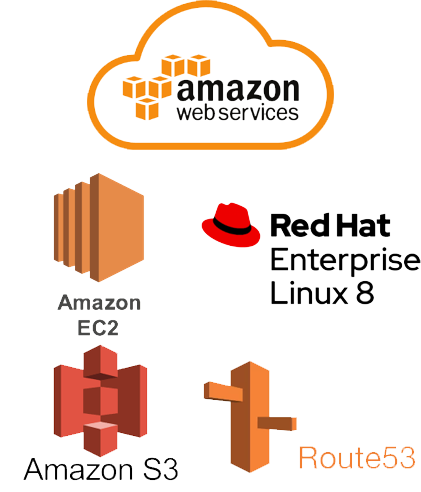

# :two_men_holding_hands: DND 2기 Team-7 Dabeen 

### &#127752; 서비스 기획내용
우리동네 작은도움 서비스
> 서비스 이용자들의 주변(동네)에서 도움을 주고받게 할 수 있는 플랫폼을 제공

### :calendar: 기간 
2019-12-28 ~ 2020-03-07

### :earth_asia: 개발환경
* frontEnd

  
  
  
  
* backEnd

  
  
----------------
### :octocat: Git
Git-Flow
* Branch
    - master  
        최종적인 기능을 갖춘 웹사이트 브랜치
    - test  
        백 엔드 개발사항과 프론트 엔드 개발사항을 합하여 테스트하기 위한 브랜치 
    - backEnd  
        백 엔드 팀의 개발사항을 종합한 브랜치
    - frontEnd  
        프론트 엔드 팀의 개발사항을 종합한 브랜치  
          
    각 팀원들의 브랜치
    - choi
    - lee
    - kwon  
    - mun
    - pyo  
    
 ### :computer: 배포
 
 프론트 
 
  

 https://dnd-dabeen.now.sh/
 
 백엔드 
 
 
 
 https://www.dabeen.org:3307/
 
 ### :ledger: 트렐로
 
 https://trello.com/b/lEJuScFe/dd-project
 
 ### 이수증
 
 DND를 2기수 이수해서 다음과 같은 수료증을 받았다.
 

 
 ### :pencil: 느낀점
 
 DND 1기를 하면서 필요성을 느꼈었던 Redux, Redux-Saga를 공부하고 적용해 볼 수 있어서 좋았다. SSR을 할 수 있게 만들어주는 프레임워크인 Next.js을 사용하며 공부할 수 있었다. 팀원들과 협업을 해볼 수 있어서 좋았다.  그리고 좀 더 react에 대해서 자세히 알 수 있었다. 다음엔 디자이너가 있는 팀에서 협업을 해보고 싶다. 디자인에 대해서는 별로 관심 없고 해본적도 없었는데 피그마를 배워보고 싶다는 생각이 들었다.
 
 하면서 좀 더 자세한 프로젝트 설계가 필요하겠다라고 느꼈다. 처음엔 에자일스럽게 하자고 요즘 에자일이 대세래~ 하면서 대충 정하고 넘어갔다가 너무 바뀐 점들이 많았기 때문이다. 그래서 프로젝트가 지연 되고 중간에 바꾸고 다시 회의하고 한다고 시간을 많이 빼앗긴 것 같다. 다음에는 애자일 방식으로 프로젝트를 진행하더라도 기본적인 개념은 확실하게 잡고 가는게 좋다고 느꼈다.
 
웹 소켓을 이용해 채팅 기능까지 구현하고 싶었는데 공부만 조금 해보고 시간 부족과 기술 부족으로 인해 구현하지 못 한점이 아쉽다. 다음에 개인 프로젝트를 통해 구현해보고 싶다.

다음 프로젝트 때는 Next.js에 대해서 좀 더 자세히 공부해서 제대로된 SSR과 SEO를 적용시켜 보고 싶고 TypeScript를 공부해 적용하여 더욱 안정적인 코드를 짜보고 싶다.

### &#127760; UI

